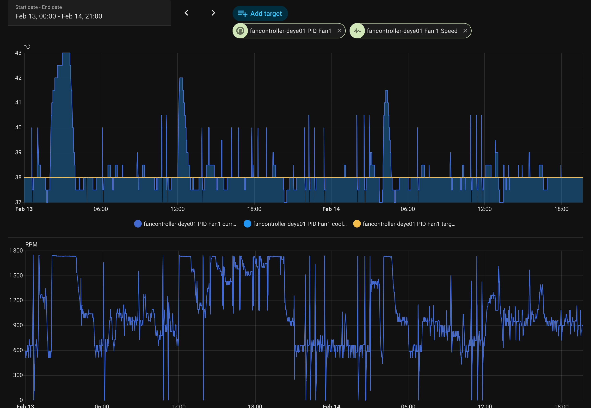
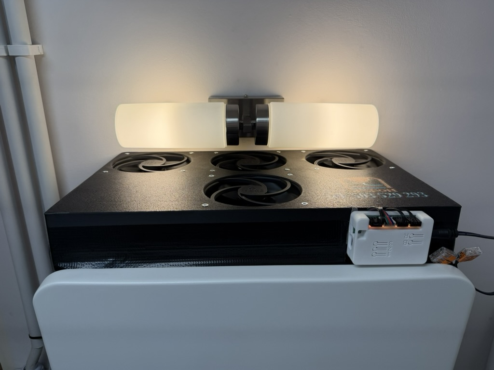

# Deye PID Fan Controller

A DIY project that uses the [zeroflow ESP32 Fan Controller](https://github.com/zeroflow/esphome-fancontroller) hardware with a custom ESPHome configuration to keep a **Deye hybrid solar+battery inverter** (like Deye SUN-10K SG05LP3) cool using PID-based temperature control.

The firmware integrates with Home Assistant to read the inverter's internal temperature and drives up to 4 PWM fans accordingly—with fallback logic when the inverter data is unavailable.




---

## Hardware

- **Base board**: [zeroflow/esphome-fancontroller](https://github.com/zeroflow/esphome-fancontroller) (Rev 3.x, ESP32-S2)
- **Temperature source**: Deye inverter temperature via Home Assistant
- **Fallback sensor**: STTS22H on Qwiic port (I2C `0x3C`) for when inverter data is stale.  
You can buy one here: https://botland.com.pl/cyfrowe-czujniki-temperatury/22679-cyfrowy-czujnik-temperatury-stts22h-wersja-micro-qwiic-sparkfun-sen-21273.html
Use long QWIIC signal cable: https://kamami.pl/przewody-jst/566106-qwiic-przewod-zensko-zenski-4-pinowy-500mm-prt-14429.html
- **Fans**: 4× 12V PWM fans with RPM monitoring (2 pulses per revolution)

---

## Features

- **PID temperature control** – Maintains target temperature with minimal overshoot
- **Inverter temperature via Home Assistant** – Uses `sensor.deye_sunsynk_sol_ark_3_phase_temperature` (adjust for your Deye entity)
- **Fallback mode** – If inverter temp is unavailable for >10 minutes, uses external STTS22H + 7°C offset
- **Slew-rate limited fan ramp** – 2% PWM per second for quieter operation
- **RPM status LEDs** – Red (stopped) → green (full speed) per fan
- **Status LED** – Boot (blue pulse), WiFi OK (green), WiFi error (red pulse)

---

## Configuration

### Required Home Assistant entity

Set the Deye inverter temperature entity in `esphome/fancontroller-deye01.yaml`:

```yaml
- platform: homeassistant
  id: deye_temperature
  entity_id: sensor.deye_sunsynk_sol_ark_3_phase_temperature  # ← Change to your Deye temp entity
```

### Secrets

Create `esphome/secrets.yaml` with:

```yaml
wifi_ssid: "Your WiFi SSID"
wifi_password: "Your WiFi password"
api_encryption_key: "your-32-char-ha-api-key"
ota_password: "your-ota-password"
```

---

## Tips & Quirks for Tinkerers

### 1. PID output via interval lambda (not direct PWM)

The ESPHome PID climate component expects a `cool_output`, but this config uses a **template output** as a dummy. The real PWM is applied in a 1-second interval lambda. This allows:

- Custom slew-rate limiting
- Fallback logic when inverter temp is unavailable
- Minimum run speed (5%) when cooling is active- that's minimal speed where fans still reliably rotates.
- True fan-off only when PID output is 0%

```yaml
# Dummy output - PID output is consumed via pid_value sensor
output:
  - platform: template
    id: pid_dummy
    type: float
    write_action:
      - lambda: |-
          // Real PWM is set in interval lambda
```

### 2. Fallback temperature when inverter data is stale

If the Deye temperature entity stops updating (e.g. inverter communication issue, HA restart), a binary sensor marks fallback mode and the controller switches to:

- **Source**: External STTS22H temperature + 7°C offset
- **Target**: Constant 50% PWM (still ramped for quiet operation)
- **Timeout**: 10 minutes (`600000` ms) without updates

Adjust the offset in `control_temperature` if your STTS22H placement differs from the inverter thermal mass.

### 3. Slew-rate limiter for quiet fans

Fans ramp at max **2% PWM per second** (`max_delta: 0.02f`). This avoids audible steps when the PID output changes quickly. Tune `max_delta` if you want faster response or even smoother ramps.

### 4. Fan RPM: 2 pulses per revolution

Most 4-pin PWM fans output **2 TACH pulses per revolution**. The pulse counter uses:

```yaml
filters:
  - multiply: 0.5   # 2 pulses per revolution → RPM
```

If your fans use a different ratio, adjust the multiplier.

### 5. RPM status LED scaling

The red→green LED mapping assumes a max RPM of **1900**. If your fans run higher, change the clamp and divisor:

```cpp
if (rpm > 1900) rpm = 1900;
float f = rpm / 1900.0;
```

### 6. PID sign inversion (cooling mode)

The P, I, D, and Error sensors use `multiply: -1.0` because cooling logic is inverted: higher temperature → higher fan speed. Without this, the PID would fight the correct direction.

### 7. External temperature smoothing

The STTS22H uses a sliding-window average (12 samples, 5 s interval) to reduce noise:

```yaml
filters:
  - sliding_window_moving_average:
      window_size: 12
      send_every: 1
```

### 8. Framework: ESP-IDF vs Arduino

This config uses `framework: type: esp-idf` instead of Arduino. If you hit build issues or prefer Arduino, you can switch to `type: arduino`; the YAML logic should work with both.

### 9. PID tuning

- **Autotune**: Use the "PID Autotune" button in Home Assistant after deployment. Observe log stream, ESPHome logs there calculated PID values that needs to be written into YAML config file.
- **Output smoothing**: `output_averaging_samples: 3` smooths over 3×5 s = 15 s

### 10. Status LED behavior

| State        | LED color | Effect |
|-------------|-----------|--------|
| Booting     | Blue      | Pulse  |
| WiFi OK     | Green     | Solid (dims after 1 min) |
| WiFi error  | Red       | Pulse  |

---

## Project structure

```
esphome/
├── fancontroller-deye01.yaml   # Main config
└── includes/packages/
    ├── wifi.yaml               # WiFi + fallback AP
    └── internal_temp.yaml      # Board temperature
```

---

## Flashing

1. Install [ESPHome](https://esphome.io/guides/installing_esphome.html)
2. Connect the board via USB-C
3. Run: `esphome run esphome/fancontroller-deye01.yaml`
4. Use the web UI or OTA for future updates

---

## References

- [zeroflow/esphome-fancontroller](https://github.com/zeroflow/esphome-fancontroller) – Base hardware and ESPHome packages
- [ESPHome PID Climate](https://esphome.io/components/climate/pid.html) – PID climate documentation
- [patrickcollins12/esphome-fan-controller](https://github.com/patrickcollins12/esphome-fan-controller) – PID example (credited in zeroflow project)
